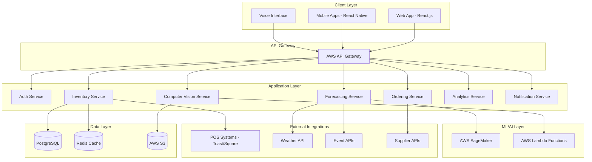

# Design Document

## Overview

Henry's SmartStock AI is a cloud-native, AI-powered inventory management system built on AWS infrastructure. The system employs a microservices architecture with separate services for inventory management, demand forecasting, computer vision processing, and supplier integration. The platform consists of a React.js web application, React Native mobile apps, and a Python FastAPI backend with PostgreSQL database and Redis caching layer.

The system leverages machine learning models for demand prediction, computer vision for automated inventory detection, and natural language processing for voice commands. Integration with existing POS systems (Toast/Square) provides real-time sales data, while external APIs deliver weather and event information for enhanced forecasting accuracy.

## Architecture

### High-Level System Architecture



### Microservices Architecture

**Authentication Service**
- JWT-based authentication with role-based access control
- User management and session handling
- Integration with OAuth providers if needed

**Inventory Service**
- Real-time inventory tracking and updates
- Multi-location inventory management
- Barcode/QR code processing
- Stock level monitoring and alerting

**Forecasting Service**
- ML-powered demand prediction using time-series models
- Integration with weather and event APIs
- Historical data analysis and pattern recognition
- Confidence interval calculations

**Computer Vision Service**
- Image processing for automated stock detection
- Bottle recognition and fill level estimation
- Integration with shelf-mounted cameras
- Real-time processing using AWS Lambda

**Ordering Service**
- Automated purchase order generation
- Supplier API integration and price comparison
- Invoice processing with OCR
- Order optimization algorithms

**Analytics Service**
- KPI calculation and dashboard data preparation
- Report generation and data visualization
- Waste analysis and anomaly detection
- Performance metrics tracking

**Notification Service**
- Multi-channel alerts (email, SMS, push notifications)
- Real-time stock alerts and system notifications
- Integration with mobile push services

## Components and Interfaces

### Core Data Models

**Inventory Item**
```python
class InventoryItem:
    id: UUID
    name: str
    category: ItemCategory
    barcode: str
    current_stock: float
    unit_of_measure: str
    location: Location
    par_level: float
    reorder_point: float
    cost_per_unit: Decimal
    supplier_id: UUID
    expiration_date: Optional[datetime]
    created_at: datetime
    updated_at: datetime
```

**Location**
```python
class Location:
    id: UUID
    name: str  # "Main Bar", "Rooftop", "Storage"
    type: LocationType
    is_active: bool
```

**Transaction**
```python
class Transaction:
    id: UUID
    item_id: UUID
    location_id: UUID
    transaction_type: TransactionType  # SALE, ADJUSTMENT, RECEIVE, WASTE
    quantity: float
    unit_cost: Optional[Decimal]
    user_id: UUID
    pos_transaction_id: Optional[str]
    timestamp: datetime
    notes: Optional[str]
```

**Forecast**
```python
class Forecast:
    id: UUID
    item_id: UUID
    location_id: UUID
    forecast_date: date
    predicted_demand: float
    confidence_lower: float
    confidence_upper: float
    model_version: str
    external_factors: Dict[str, Any]  # weather, events, etc.
    created_at: datetime
```

### API Interfaces

**Inventory Management API**
```python
# GET /api/v1/inventory/items
# POST /api/v1/inventory/items/{item_id}/adjust
# GET /api/v1/inventory/locations/{location_id}/stock
# POST /api/v1/inventory/scan
```

**Forecasting API**
```python
# GET /api/v1/forecasts/demand/{item_id}
# POST /api/v1/forecasts/retrain
# GET /api/v1/forecasts/accuracy-metrics
```

**Computer Vision API**
```python
# POST /api/v1/vision/analyze-shelf
# POST /api/v1/vision/detect-bottles
# GET /api/v1/vision/processing-status/{job_id}
```

**Ordering API**
```python
# GET /api/v1/orders/suggestions
# POST /api/v1/orders/create
# GET /api/v1/suppliers/pricing
# POST /api/v1/invoices/process-ocr
```

### Integration Interfaces

**Tabit POS System Integration**
- Webhook endpoints for real-time sales data from Tabit's cloud platform
- API client for Tabit's inventory and sales endpoints
- Data transformation layer mapping Tabit's schema to internal models
- Multi-location support leveraging Tabit's location-based inventory tracking

**External API Integration**
- Weather API client with caching and rate limiting
- Event calendar scraping and API integration
- Supplier API clients with authentication handling

## Data Models

### Database Schema Design

**Primary Tables:**
- `inventory_items` - Core inventory item information
- `locations` - Bar locations and storage areas
- `transactions` - All inventory movements and sales
- `forecasts` - ML-generated demand predictions
- `users` - System users with role-based permissions
- `suppliers` - Vendor information and API credentials
- `purchase_orders` - Automated and manual orders
- `invoices` - Supplier invoices and OCR processing results

**Relationship Design:**
- Items can exist in multiple locations (many-to-many)
- Transactions link items, locations, and users
- Forecasts are generated per item-location combination
- Orders contain multiple items from single suppliers

### Caching Strategy

**Redis Cache Structure:**
- Real-time inventory levels: `inventory:{location_id}:{item_id}`
- User sessions: `session:{user_id}`
- Forecast cache: `forecast:{item_id}:{date}`
- API rate limiting: `rate_limit:{api_key}:{endpoint}`

## Error Handling

### Error Categories and Responses

**Client Errors (4xx)**
- 400 Bad Request: Invalid input data or malformed requests
- 401 Unauthorized: Authentication required or invalid credentials
- 403 Forbidden: Insufficient permissions for requested action
- 404 Not Found: Requested resource does not exist
- 429 Too Many Requests: Rate limit exceeded

**Server Errors (5xx)**
- 500 Internal Server Error: Unexpected server-side errors
- 502 Bad Gateway: External service integration failures
- 503 Service Unavailable: Temporary service outages
- 504 Gateway Timeout: External API timeout errors

### Error Handling Strategies

**Graceful Degradation**
- Offline mode for mobile apps during network outages
- Cached data serving when real-time updates fail
- Manual override options for automated processes

**Retry Mechanisms**
- Exponential backoff for external API calls
- Circuit breaker pattern for unreliable services
- Dead letter queues for failed message processing

**Monitoring and Alerting**
- Real-time error tracking with AWS CloudWatch
- Automated alerts for critical system failures
- Error rate thresholds and escalation procedures

## Testing Strategy

### Testing Pyramid

**Unit Tests (70%)**
- Individual function and method testing
- Mock external dependencies
- Test coverage target: 90%+
- Automated execution in CI/CD pipeline

**Integration Tests (20%)**
- API endpoint testing with test database
- External service integration testing with mocks
- Database transaction and rollback testing
- Cross-service communication validation

**End-to-End Tests (10%)**
- Critical user journey automation
- Mobile app functionality testing
- POS integration validation
- Performance and load testing

### Testing Tools and Frameworks

**Backend Testing**
- pytest for Python unit and integration tests
- Factory Boy for test data generation
- pytest-asyncio for async function testing
- Testcontainers for database integration tests

**Frontend Testing**
- Jest and React Testing Library for React components
- Cypress for end-to-end web application testing
- Detox for React Native mobile app testing
- Storybook for component visual testing

**Performance Testing**
- Locust for load testing and performance validation
- AWS X-Ray for distributed tracing and bottleneck identification
- Artillery for API stress testing
- Lighthouse for web performance auditing

### Continuous Integration

**CI/CD Pipeline**
- GitHub Actions for automated testing and deployment
- Automated test execution on pull requests
- Code quality checks with SonarQube
- Security scanning with Snyk
- Automated deployment to staging and production environments

**Quality Gates**
- Minimum test coverage requirements
- Code review approval requirements
- Security vulnerability scanning
- Performance regression testing
- Database migration validation

### Machine Learning Model Testing

**Model Validation**
- Cross-validation for forecast accuracy
- A/B testing for model performance comparison
- Backtesting on historical data
- Model drift detection and retraining triggers

**Data Quality Testing**
- Input data validation and cleansing
- Feature engineering pipeline testing
- Model prediction boundary testing
- Bias detection and fairness validation